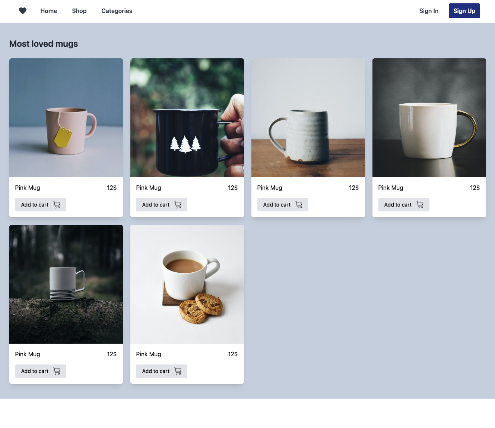

# TailwindCSS-Component: ECommerce Products Gallery

This GitHub repository contains the HTML and TailwindCSS code for an E-commerce Product Gallery designed specifically for showcasing products. 
The design is responsive, highly customizable, and leverages TailwindCSS for all its styling needs, ensuring a sleek and modern user interface.

  

#### Features
- **Responsive Design**: Adapts smoothly to different device sizes from mobile to desktop.
- **TailwindCSS for Styling**: Uses TailwindCSS for a clean, utility-first approach, making it easy to modify and extend.
- **Interactive Elements**: Includes interactive buttons like "Add to Cart" for each product to facilitate user engagement.

#### Included Files
- `index.html`: Contains the HTML structure of the page.

#### Usage
To use or modify this project, no installation process is required thanks to the use of Play CDN for TailwindCSS. You can simply clone the repository and open the `index.html` file in your browser.

Access it here: https://eliottdelhaye.github.io/TailwindCSS-Component-E-Commerce-Products-Gallery/
